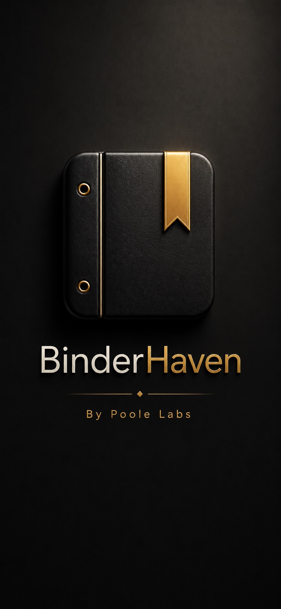

  

<h1 align="center">BinderHaven</h1>

  <strong>Modern Collection Management</strong> 
  Built with Flutter by <strong>Poole Labs</strong>.

---

# 📖 Overview

BinderHaven is a modern cross-platform application built to help collectors organize, browse, and manage their collections through an intuitive digital binder experience.

Designed with performance, simplicity, and scalability in mind, BinderHaven provides a premium experience across desktop and mobile devices.

> **Our mission is simple: Build the best digital binder for collectors.**

---

# ✨ Vision

Managing a collection should feel effortless.

BinderHaven is being built to provide a clean, elegant, and enjoyable experience that allows collectors to focus on their collections—not the software.

---

# 🚀 Current Features

- Modern Flutter architecture
- Material Design 3
- Responsive desktop interface
- Cross-platform foundation
- Custom branding
- Theme support
- Sprint-based development workflow

---

# 🛣 Roadmap

## Current Focus

- 🚧 Binder Management
- Collection Management
- Search
- Smart Filters
- Statistics Dashboard

## Planned

- Import & Export
- Cloud Synchronization
- Backup & Restore
- Multiple Collection Types
- Mobile Companion Experience

---

# 🛠 Technology Stack

| Technology | Purpose |
|------------|---------|
| Flutter | Cross-platform UI Framework |
| Dart | Programming Language |
| Material Design 3 | User Interface |
| SQLite | Local Database |
| GitHub | Version Control & CI/CD |

---

# 📷 Preview

The artwork above represents the visual direction of BinderHaven.

As development progresses, this section will be updated with screenshots from the live application.

---

# 🏗 Development Philosophy

BinderHaven is developed using an iterative sprint methodology.

Every feature follows a consistent process:

1. Planning
2. Design
3. Development
4. Testing
5. Review
6. Release

This approach keeps development predictable, maintainable, and focused on quality.

---

# 🎯 Goals

- Deliver an exceptional collector experience
- Build a fast and intuitive interface
- Support desktop and mobile platforms
- Maintain a scalable architecture
- Ship polished, production-quality software

---

# 👨‍💻 About Poole Labs

Poole Labs is an independent software studio focused on building modern productivity software with thoughtful design and exceptional user experiences.

BinderHaven is the flagship product currently under active development.

---

# ⭐ Project Status

🚧 **Active Development**

BinderHaven is under active development with regular commits, sprint milestones, and continuous improvements.

---

## 📅 Current Sprint

**Sprint 2 — Binder Management**

### Objectives

- [ ] Create Binder
- [ ] Rename Binder
- [ ] Delete Binder
- [ ] Local Persistence
- [ ] Sidebar Navigation
- [ ] Unit Testing

---

## 🤝 Contributing

BinderHaven is currently in private active development.

Public contributions will be welcomed after the first public alpha release.

---

## 📄 License

License information will be added prior to the first public release.

---

**Developed by Poole Labs**

